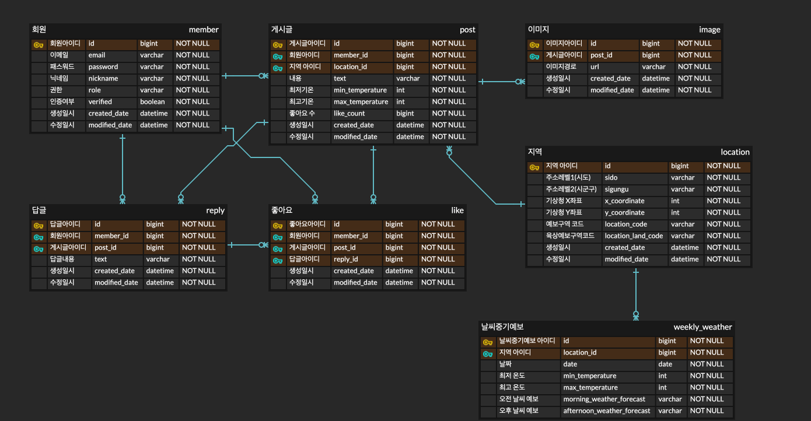

# 기온 별 옷차림 제공 서비스
- 날씨 정보와 날씨에 적합한 옷차림을 제공하고, 옷차림에 대한 글을 작성할 수 있는 커뮤니티 서비스입니다.

### 프로젝트 기능 및 설계
[회원관리]

- 회원가입
    - 이메일(unique), 패스워드, 닉네임으로 회원가입
        - 이미 가입한 이메일일 경우 예외 처리
        - 패스워드는 암호화 처리하여 db에 저장
    - 일반 회원가입 시 이메일 인증 후 회원 db 등록
        - 회원가입으로부터 24시간 내 이메일 인증 필요
        - 인증 유효 시간(24시간) 경과 시 예외 처리
    
- 로그인
    - SNS서비스를 통한 로그인 가능
    - 이메일, 패스워드 입력하여 로그인
        - 이메일, 패스워드 틀렸을 경우 예외 처리
        - 존재하지 않는 이메일일 경우 예외 처리
    - 로그인 시 jwt access token, refresh token 발급
      - refresh token redis 저장
- 로그아웃
    - access token을 redis blacklist 추가
    - redis에서 refresh token 삭제
- 비밀번호 변경
    - 이메일 인증을 통해 처리
- 회원정보 조회
    - 토큰 정보를 통해 본인 회원정보 조회만 가능
    - 토큰 정보 미일치시 예외 처리
- 회원 탈퇴
    - 회원 탈퇴 요청 시 즉시 db에서 삭제
      - redis 토큰정보 삭제 후 db에서 회원정보 삭제
    - 토큰 정보를 통해 본인 회원정보 삭제만 가능
    - 토큰 정보 미일치시 예외 처리

[날씨 정보 및 기온별 적당한 옷차림 조회]

- 지역별 단기 날씨 정보 조회(3일 : 오늘, 내일, 모레)
    - Open API를 통해 조회 및 캐시 저장(지역은 위경도 또는 주소로 조회, default : 현재위치 위경도 조회)
      - 기상청 조회 가능한 좌표계와 위경도 좌표계가 상이하여, 카카오 open api를 통해 위경도를 주소(시도/ 시군구)로 변환하여 조회 
      - 시군구 레벨까지 주소로 조회 시 db에서 저장된 해당 주소의 X, Y좌표를 읽어와 외부 API 단기 날씨 조회
      - 단기 날씨는 3시간 간격 업데이트 되기 떄문에 캐시에만 저장
    - 오늘, 내일, 모레 날씨 최저 최고 온도, 하늘 상태(비, 흐림, 맑음 등) 및 기온 구간마다 저장되어 있는 옷차림 목록 반환
  (ex. 평균 기온 18도 일 경우 17~19도 구간에 해당하여 니트, 가디건, 후드티, 맨투맨, 청바지, 면바지 등 반환)
    - 참고용으로 시간별 온도, 시간별 하늘 상태(흐림, 맑음), 시간별 강수형태(눈, 비 등) 반환
    - 옷차림의 경우 아래 이미지를 참고하여 enum으로 구성
      

- 지역별 중기 날씨 정보 조회(3일 후 ~ 7일 후)
    - Open API를 통해 조회 및 db 저장(지역은 시/군/구 레벨로 조회)
      - 시/군/구 레벨의 지역과 예보 구역 코드(기상청 예보구역 조회 시 필요), X좌표, Y좌표는 미리 db에 저장(기상청 자료 활용)
      - 중기 날씨 정보는 매일 06, 18시 업데이트 되기 때문에 발표시간에 맞춰 스케쥴링 적용
    - 요일별 최저 최고 온도, 날씨 예보(흐림, 맑음 등) 정보만 제공

[옷차림 게시판]

- 게시판
    - 게시판 글 작성
        - 로그인 한 회원만 작성 가능
        - 글(300자 이하), 사진(3장 이하)로 업로드
        - 회원이 활동한 지역 선택(시군구 레벨까지)
          - 지역 선택 시 해당 지역의 좌표를 db에서 가져와 외부 Api를 통해 최저 기온, 최고 기온 조회
    - 게시판 글 수정
        - 작성자만 수정 가능
    - 게시판 글 목록 조회
        - 페이징 처리
        - 게시판 글 목록 정렬
            - 최신순, 좋아요, 기온별(평균기온) 오름차순/내림차순
    - 게시판 글 조회
        - 회원이 아니어도 조회 가능
        - 게시판 글 조회 시 반환 목록
            - 작성일
            - 회원 글 작성 시 입력한 지역(시군구 레벨)
            - 작성일자 및 회원 입력지역 기준 날씨 정보(최저, 최고 기온)
            - 사진 및 작성 글
            - 작성자(닉네임)
            - 좋아요 숫자
    - 게시판 글 삭제
        - 작성자, 관리자 삭제 가능
    
- 좋아요 기능
    - 게시글 및 답글에 사용 가능
    - 로그인 한 회원만 가능
    - 회원 당 1회만 가능
    - 취소 가능
- 답글 기능(대댓글 허용 X)
    - 답글 작성 : 로그인 회원만 가능, 글 (100자 이내) 작성
    - 답글 조회 : 작성자(닉네임), 작성일시, 내용 반환
    - 답글 수정 : 작성자만 가능
    - 답글 삭제 : 작성자 및 관리자만 가능

[공통]

- 회원 별 작성 게시글 리스트 조회
- 회원 별 선택한 좋아요 리스트 조회
- 회원 별 답글 작성 리스트 조회

[사용 예정 open API]

- [기상청 단기예보 조회 서비스](https://www.data.go.kr/data/15084084/openapi.do)
- [기상청 중기예보 조회 서비스](https://www.data.go.kr/data/15059468/openapi.do#tab_layer_detail_function)

[추가 고려해 볼 사항]

- 지역별 중기 날씨 정보 조회 시 스케쥴링을 스프링 배치 활용
- 게시판 내 음란물, 불법광고 등 필터링 방안
- 날씨 조회 지역 즐겨찾기 기능
- 날씨 알람 설정 및 알림(앱푸쉬 등)

### ERD

### Troubleshooting
[go to the troubleshooting section](doc/trouble_shooting.md)

### Tech Stack
- Java 17
- Spring boot 3.1.6
- Spring Security
- Spring data JPA
- MySQL
- Redis
- AWS S3